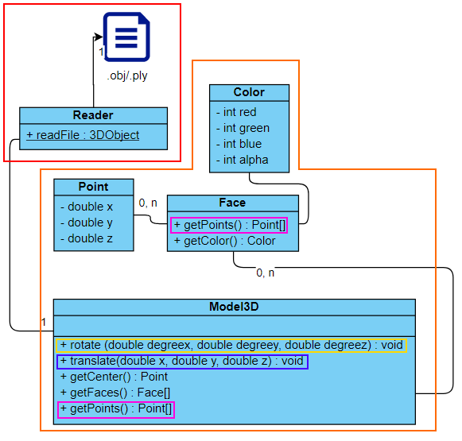

# Projet modélisation I3
Ce projet est un logiciel de visualisation 3D permettant de charger des fichiers au format ply. Il a été réalisé lors de notre seconde année de DUT Informatique.

# Fonctionnalités

 - obtenir tout les fichiers compatibles dans un dossier donné suivis des informations importantes
 - lire un modèle 3D au format PLY (header + body) et détecter d'éventuelles érreurs
 - générer un modèle 3D a partir des informations d'un fichier
 - afficher un modèle 3D
 - éffectuer translations/rotations/zoom sur un modèle éxistant
 

# Compiler/Lancer
les informations pour compiler/lancer le programme se trouvent [sur cette page](build-run.md)

# Participations
**Guilhane** (guilamb, guilhanebourgin, guilhane.bourgoin.etu)
 - Rotations
 
**Maxime** (Maxime, Maxime Boutry)
 - Translations
 
**Luca**
 - PLY Parser
 
**Léopold** (Leopold Hubert, leopold)
 - UML
 - Structure du projet
 - PLY/Folder Parser
 
**Victor**
 - Fenêtre javaFX
 
# précisions
Pour la réalisation de ce projet, Victor a du rattraper son retard en refaisant les tp de S2 (courrage). De ce fait, il a été compliqué pour lui de s'investir pleinement.

Ce projet a été réalisé avec Gradle car notre maîtrise de celui-ci est plus importante qu'avec Maven.